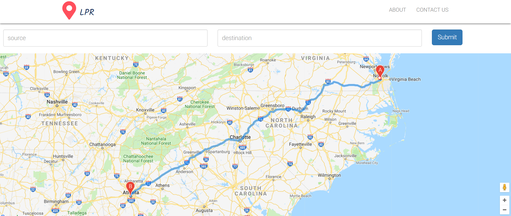
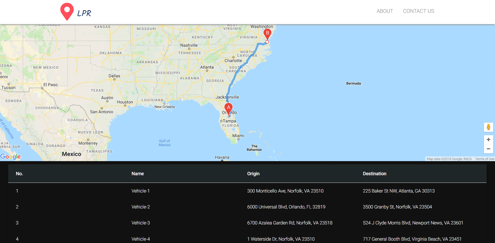

# AngularLpr
The reponsive Mockup UI client was aimed to track the current location of the vehicle from source to destination using google maps API. The search can also use the search form to look of directions from source to destination just like regular google maps.
The place autocomplete by Google maps was used to search for an address or specific location.

## Technologies
```
Angular CLI 6.0.8, TypeScript, Boostrap, CSS,Angular Google Maps, Places autocomplete by Google Maps, Agm-Direction
```
This project was generated with [Angular CLI](https://github.com/angular/angular-cli) version 6.0.8.

## Development server

Run `ng serve` for a dev server. Navigate to `http://localhost:4200/`. The app will automatically reload if you change any of the source files.

## Code scaffolding

Run `ng generate component component-name` to generate a new component. You can also use `ng generate directive|pipe|service|class|guard|interface|enum|module`.

## Further help

To get more help on the Angular CLI use `ng help` or go check out the [Angular CLI README](https://github.com/angular/angular-cli/blob/master/README.md).

## Image


## Image

